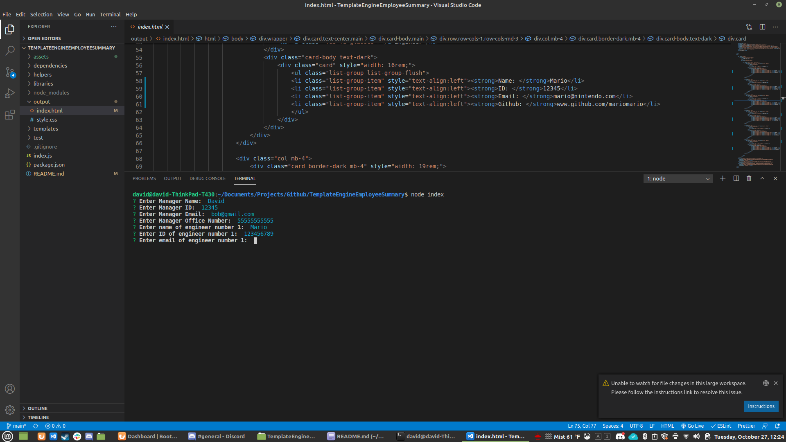

# **Employee Template Generator**

## Description 
This project takes in emplyee information and outputs a styled html file that displays employee information
## Table of contents
- [Description](#Description)
- [Installation](#Installation)
- [Usage](#Usage)
- [Licence](#Licence)
- [Contributors](#Contributors)
- [Test](#Test)
- [Repository Link](#Repository)
- [Submit Questions to:](#GitHub) 
## Installation
clone repository from github

[

## Usage
open a terminal on the file where the application is installed and enter node index. enter requested information.

## Licence
GNU AGPLv3
## Contributors
David Stinnett
## Test
run the application and report any issues to me at the contact information below
## Repository
- [Project Repo](https://github.com/serjykalstryke/TemplateEngineEmployeeSummary)

## Sample of application in action

## Questions? Contact me here:

- David Stinnett
- [GitHub Profile](https://github.com/serjykalstryke)
- <davidstinnett@icloud.com>
